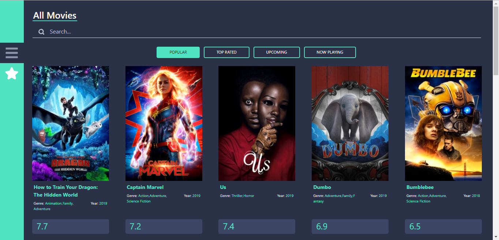
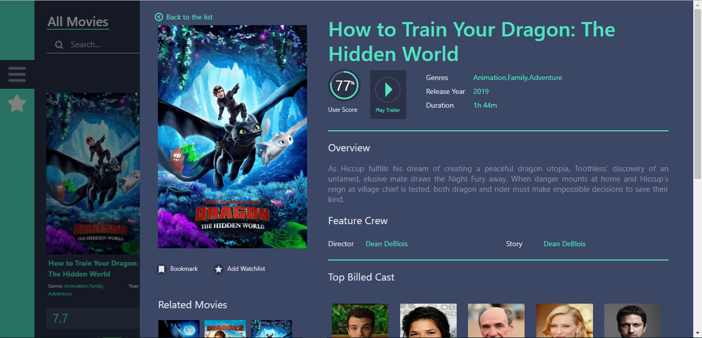
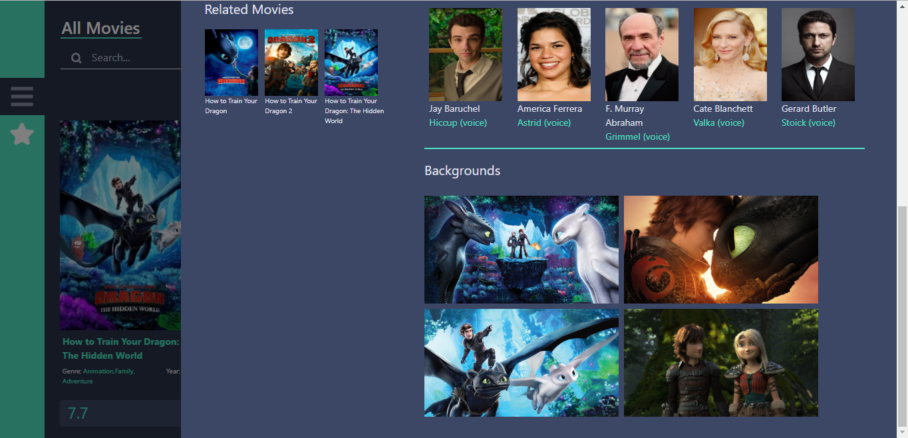
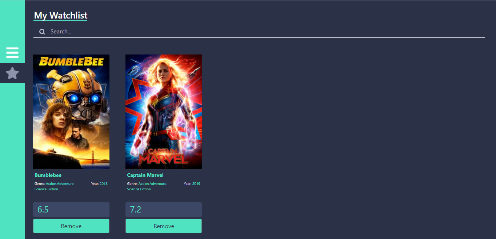
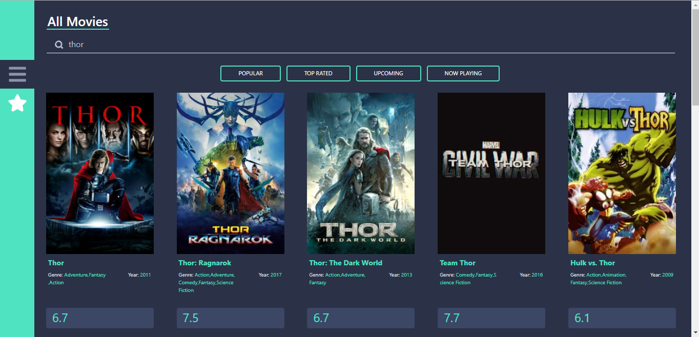

# Movie App
> This movie site can search movies, add to watchlist and view movie detail.This site is developed using ReactJS and MovieDB API.

## Home

## Movie Detail

## Watchlist

## Search Movie

## Setup
Movie App Demo http://tzwl.github.io/ReactMovie

* npm install -g create-react-app
* create-react-app projectfolder
* npm install react-modal-video
* npm install reactjs-popup --save
* npm i jquery
* npm i react-icons
* npm install --save reactstrap react react-dom
* npm i bootstrap 

## Status
Project is:  _finished_

## Additional Note
How to deploy react app to github pages 
https://github.com/gitname/react-gh-pages/blob/master/README.md

